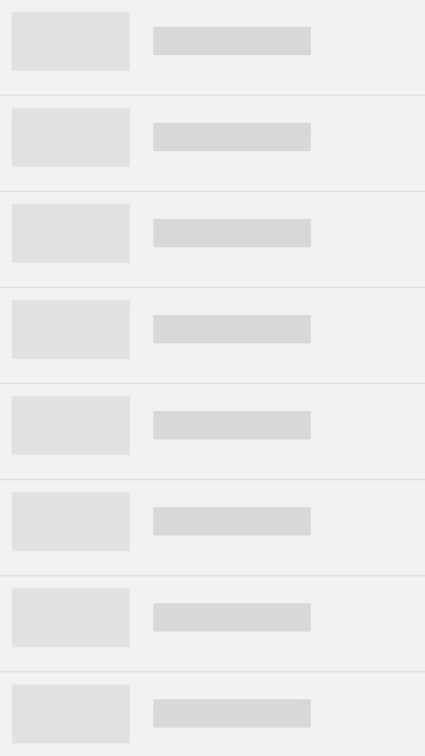

# Facebook like Shimmer effect in Android

* __Whatis Shimmer Effect__:
A more effective way to use or add placeholder or loader as shimmering effect to any view for an Android application.

* __Why Shimmering Effect?__

We generally use anmated loaders when the app wants to load the data from a network call. 
Instead of using the usual loaders, to make our app more interesting using Shimmering effect would be a
efficient for our user. This library adds Shimmer effect on to any custom view that we define.
I hope you earlier noticed this shimmer effect in Facebook’s mobile and desktop apps.

# Getting Started

 ## Usage
   ### Step 1 : Add "facebookShimmerAndroid" to your Android project.

   1- Open your project in Android Studio.
   2- Download the library
       (using Git Link ---> https://github.com/yash786agg/facebookShimmerAndroid.git)
                                        or 
       (Download a zip File archive to unzip)
    
   3- Create a folder "ShimmerLib" in your project.
   4- Copy and paste the Code to your ShimmerLib folder
   5- On the root of your project directory create/modify the settings.gradle file. It should contain something like the following:

      include 'MyApp', ':ShimmerLib'

   6- Go to File > Project Structure > Modules.
   7- App > Dependencies.
   8- Click on the more on the left green "+" button > Module dependency.
   9- Select "ShimmerLib Library".

* __When you want to start the Shimmering Effect__

        rclv.setVisibility(View.GONE);
        animationLayout.setVisibility(View.VISIBLE);
        FiftyShadesOf.with(this).on(R.id.animationLayout).fadein(true).start();
        
* __When you want to stop the Shimmering Effect__        
        
        yourRecylerView.setVisibility(View.VISIBLE);
        animationLayout.setVisibility(View.GONE);
        this.runOnUiThread(new Runnable()
                {
                    @Override
                    public void run()
                    {
                        FiftyShadesOf.with(this).on(R.id.animationLayout).stop();
                    }
                });
        
* __Layout file should look like for Shimmering Effect__    

      <RelativeLayout xmlns:android="http://schemas.android.com/apk/res/android"
        xmlns:tools="http://schemas.android.com/tools"
        android:layout_width="match_parent"
        android:layout_height="match_parent">
      <android.support.v7.widget.RecyclerView
                android:id="@+id/rclv"
                android:layout_width="match_parent"
                android:layout_height="wrap_content"
                android:visibility="gone"
                android:background="#f1f2f2" />
                
      <LinearLayout
                android:id="@+id/viewLL"
                android:layout_width="match_parent"
                android:layout_height="match_parent"
                android:orientation="vertical"
                android:background="#f1f2f2">

                <include layout="@layout/viewlayout"/>

       </LinearLayout>         

       </RelativeLayout>    

* __viewlayout__

        <LinearLayout xmlns:android="http://schemas.android.com/apk/res/android"
            android:orientation="vertical"
            android:layout_width="match_parent"
            android:layout_height="wrap_content">

            <LinearLayout
                android:layout_width="match_parent"
                android:layout_height="match_parent"
                android:orientation="horizontal">

                <ImageView
                    android:layout_width="100dp"
                    android:layout_height="50dp"
                    android:layout_marginLeft="10dp"
                    android:layout_marginStart="10dp"
                    android:layout_marginTop="10dp"
                    android:layout_marginBottom="10dp"
                    android:layout_gravity="center_vertical"
                    android:background="@mipmap/ic_launcher"/>

                <TextView
                    android:layout_width="wrap_content"
                    android:layout_height="wrap_content"
                    android:text="@string/app_name"
                    android:textSize="17sp"
                    android:textStyle="bold"
                    android:layout_gravity="center"
                    android:layout_marginStart="20dp"
                    android:layout_marginLeft="20dp"
                    android:textColor="#000"/>

            </LinearLayout>
        </LinearLayout>  

# Demo
    

# Prerequisites
* __Android Studio 3.0__
* __Android Device with USB Debugging Enabled__

# Built With

* __[Android Studio](https://developer.android.com/studio/index.html)__ - The Official IDE for Android
* __[Java](https://en.wikipedia.org/wiki/Java_(programming_language))__ - The Official Language for Android
* __[Gradle](https://gradle.org)__ - Build tool for Android Studio

Thanks for reading this repo. Be sure to click ★ below to recommend this repo if you found it helpful. It means a lot to me.

For more about programming, follow me on [Medium](https://medium.com/@yash786agg)

Also, Let’s become friends on [Linkedin](http://bit.ly/24t4EVI)
